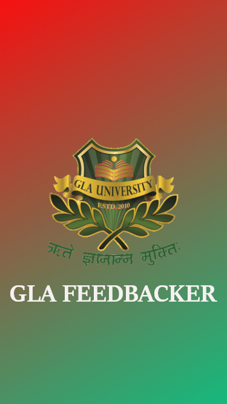
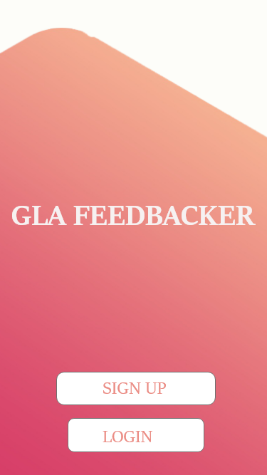
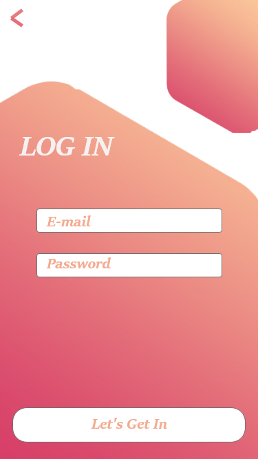
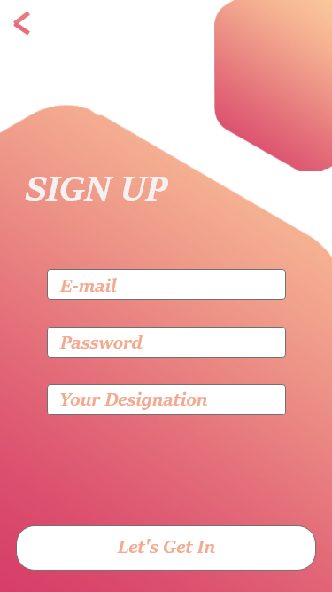
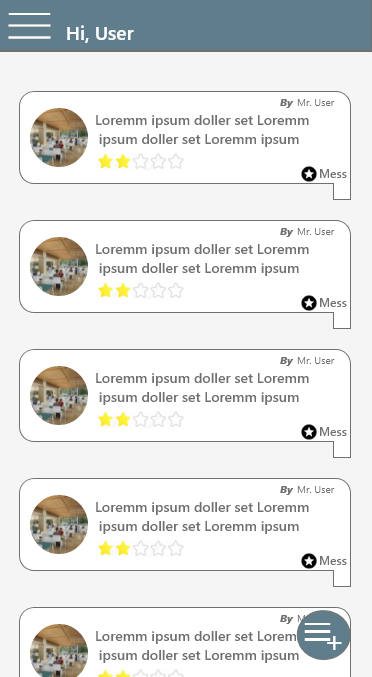
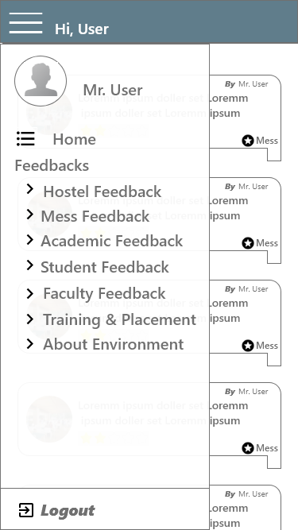
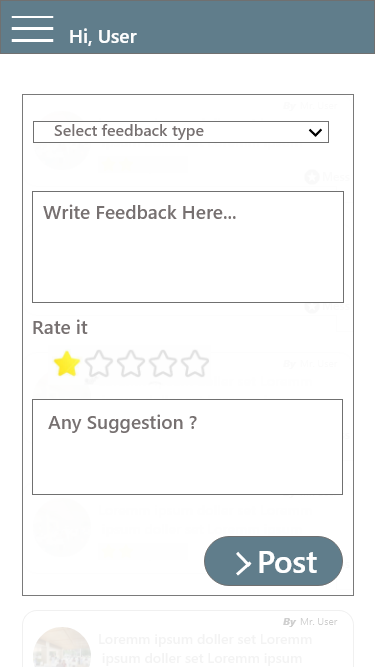
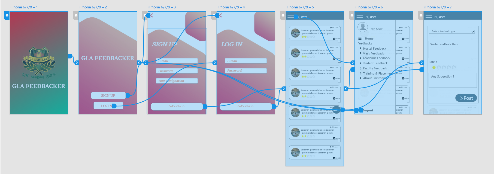

# GLA University Mathura, 2019

## Mini Project Synopsis

## Project Name
GLA Feedbacker

## Team Members

1. Amit Sharma(https://github.com/amits999)
2. Govind Jha(https://github.com/go999ind)
3. Akshita Bajpai(https://github.com/akshitabajpai)
4. Ankit Maurya(https://github.com/ankit07-11)

___

#### THE PROBLEM STATEMENT

```
There is much lack of concrete communication between the management and students.Also management is
unable to take feedback from every student personally in all the fields.Due to this a lot of time is wasted for both of them.
```

___

#### REASON FOR SELECTING THE TOPIC

```
Students usually face the problem in academics, hostels, mess, and placement department in which
they are not able to discuss queries about some kinds of stuff. So to reduce this we are making an
application in which no student will be notified but their feedback will be received by our managers.
With help of this project, students can give specific points in various fields of management.
```

___

#### OBJECTIVES OF THE PROJECT

```
> Decision-making power is provided by the system.
> Accurate results will be obtained.
> Will make the selection process more efficient.

```
___

#### LITERATURE SURVEY / FEASIBILITY STUDY

```
Often seen in our University that students are not comfortable with their faculty members due
to which they are not able to convey it to the management.
Also, the problem is seen in the mess where some hostelers face problems related to food items
and other issues. Hostelers also face problems in hostels related to their room facilities and others.

```

___

#### FUTURE SCOPE

```
As we are making an android application for our project, it will be very beneficial for the students
of GLA University to give feedback and for administration to receive it, in order to make a healthy environment  of the university.
```

___

#### METHODOLOGY

```
The project GLA Feedbacker is an application developed to give valuable feedback to the administration
given by the students of academics, hostels, mess, and the training and placement department.
Instead of giving manual or physical feedback, we are providing an online application in which only
required and important feedback will be given to the director, while other unwanted comments will be
strained out by the group of some managers. We develop the system to manage our administration in a
proper manner so that our university comprises of best faculties, food, and facilities in hostels.

```

___

#### HARDWARE & SOFTWARE TO BE USED FOR DEVELOPMENT

```
Hardware:
> Microsoft Window® 7/8/10(32- or 64-bit)
> Minimum 8Gb RAM
> Minimum i3 processor

Software:
> Android Studio
> JDK

```

___

#### TESTING TECHNOLOGIES TO BE USED

```
> Espresso
```

___

#### WHAT CONTRIBUTION WOULD THE PROJECT MAKE AND WHERE?

```
The project will be helpful for the students and administration who need to control the management.
Like in hostels, academics, mess, and training and placement department of GLA University.
This project will help to manage the administration in a right way where students are satisfied by the management.
```

___

#### SCOPE FOR EXTENSION INTO A MAJOR PROJECT

```
> Extending it for use of every student in our university.
> Including some more sections in the feedback.
> Implementing the security in our application.
```

___

#### CONCLUSION

```
The purpose of this project is to make the process of taking feedback from the students in
online regarding the lecturer’s teaching, hostel facilities, and mess food. With this, the student
can successfully submit feedback in a very efficient manner without any loss of data.
The administrator and the faculty members can access these feedback from the students and take appropriate actions.
```
___

## Mock-Up Screens


#### Home Screen



#### Auth Screen



#### Login Screen



#### Signup Screen



#### Main Panel Screen



#### Navigation drawer Screen



#### New Feedback Screen



#### Wireframe

